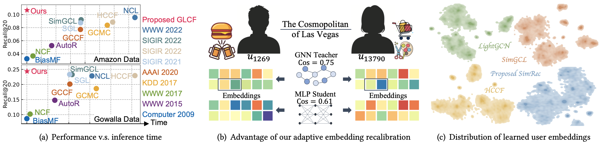
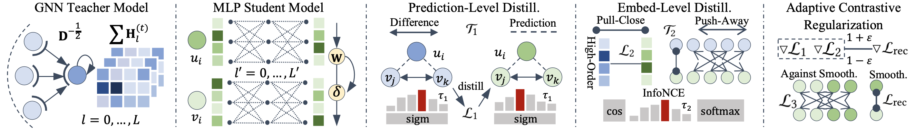

# Graph-less Collaborative Filtering

This is the pyTorch-based implementation for SimRec model proposed in this paper:

>Lianghao Xia, Chao Huang, Yong Xu and Jiao Shi. <i>Graph-less Collaborative Filtering</i>. In WWW'23, Austin, US, April 30 - May 4, 2023.

## Introduction
Though Graph Neural Networks (GNNs) have provided state-of-the-art network architectures for collaborative filtering, the accuracy and extensibility of existing GNN-based methods are limited by the noise-amplifying over-smoothing effect and the time-consuming iterative graph encoding process. Three experiments below illustrate these limitations of existing models and present the superiority of the proposed SimRec <i>w.r.t.</i> these issues. <i>Firstly</i>, recent GNN-based CF models generally advance in recommendation accuracy while sacrificing model efficiency as in (a). However, our SimRec achieves accurate recommendation while keeping low computation costs in inference. <i>Secondly</i>, GNN models are prone to produce over-smoothed embeddings for false neighbors like in (b), while the proposed SimRec is less-affected by such noisy edges and still produces unlike embeddings to capture their respective characteristics. <i>Additionally</i>, compared to recent SSL-enhanced models, SimRec is evaluated to better distribute the user embeddings in a more uniform manner.



To address the above limitations, we propose to leverage the power of knowledge distillation, to distill the knowledge learned by the advanced but heavy GNN teacher to a light-weight MLP student, by doing which the time complexity of model inference is reduced and the hard graph aggregation causing over-smoothing is avoided. Specifically, we adopt a bi-level distillation approach, containing the prediction-level distillation aligning the predictions for user-item relations, and the embedding-level distillation which aligns the learned embeddings using contrastive learning. A contrastive regularization term is added into the optimization objective, to learn more-uniform representations. The overall model architecture is depicted as follows:



## Citation
```
@inproceedings{graphless2022,
  author    = {Xia, Lianghao and
               Huang, Chao and
               Xu, Yong and
               Shi, Jiao},
  title     = {Graph-less Collaborative Filtering},
  booktitle = {The Web Conference (WWW)},
  year      = {2023},
}
```

## Environment
The implementation for SimRec is under the following development environment:

pyTorch:
* python=3.10.4
* torch=1.11.0
* numpy=1.22.3
* scipy=1.7.3

## Datasets
We utilize three datasets for evaluating SimRec: <i>Yelp, Gowalla, </i>and <i>Amazon</i>. Note that compared to the data used in our previous works, in this work we utilize a more sparse version of the three datasets, to increase the difficulty of recommendation task. Our evaluation follows the common implicit feedback paradigm. The datasets are divided into training set, validation set and test set by 70:5:25.

## Usage
Please unzip the datasets first. Also you need to create the `History/` and the `Models/` directories. The command lines to train SimRec using our pre-trained teachers on thre three datasets are as below. The un-specified hyperparameters in the commands are set as default. If you wish to train another teacher, you may use `pretrainTeacher.py` for convienience.

* Yelp
```
python Main.py --data yelp --cd 1e-1 --soft 10 --tempsoft 1e-2 --sc 5 --reg 1e-6
```
* Gowalla
```
python Main.py --data gowalla --sc 1 --soft 1e-1 --cd 1e-2
```
* Amazon
```
python Main.py --data amazon --reg 1e-7 --soft 1 --cd 1e-1 --sc 1
```

### Important Arguments
* `reg`: It is the weight for weight-decay regularization. We tune this hyperparameter from the set `{1e-3, 1e-4, 1e-5, 1e-6, 1e-7, 1e-8}`.
* `softreg`: This is the weight for the prediction-level distillation.
* `cdreg`: This parameter denotes the weight for the embedding-level distillation.
* `screg`: This is the weight for the contrastive regularization.
* `tempsoft`: The temperature for the prediction-level distillation.
* `tempcd`: The temperature for the embedding-level distillation.
* `tempsc`: The temperature for the contrastive regularization.
* `teacher_model`: This is a string refering the saved teacher model. If this value is `None`, then the default teacher is loaded.